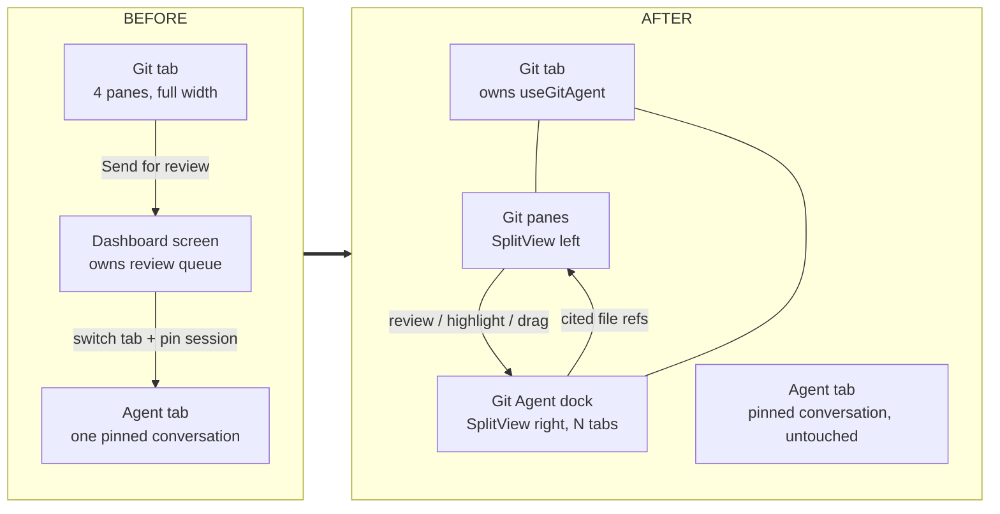
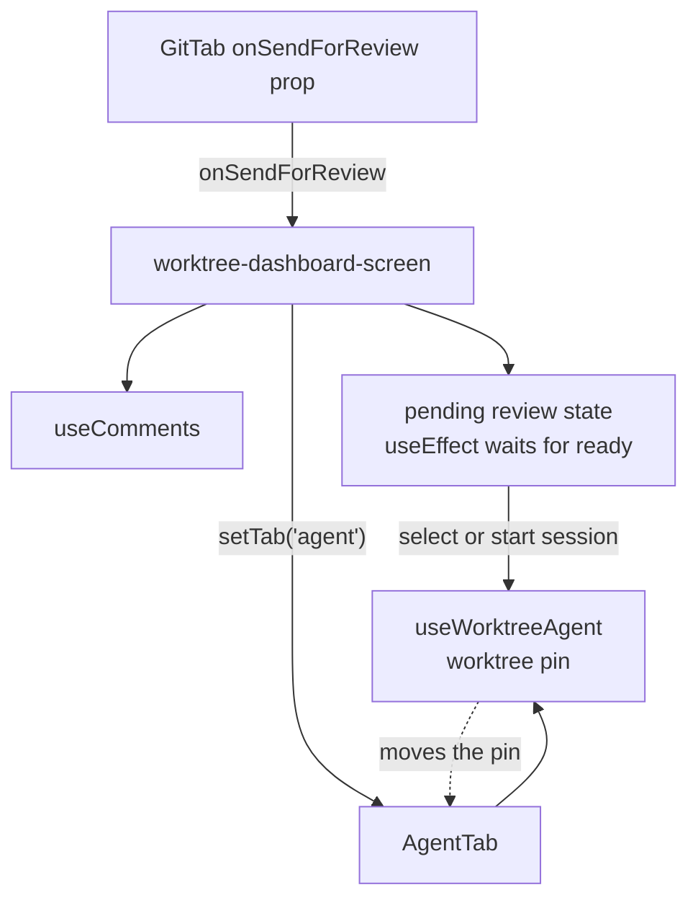
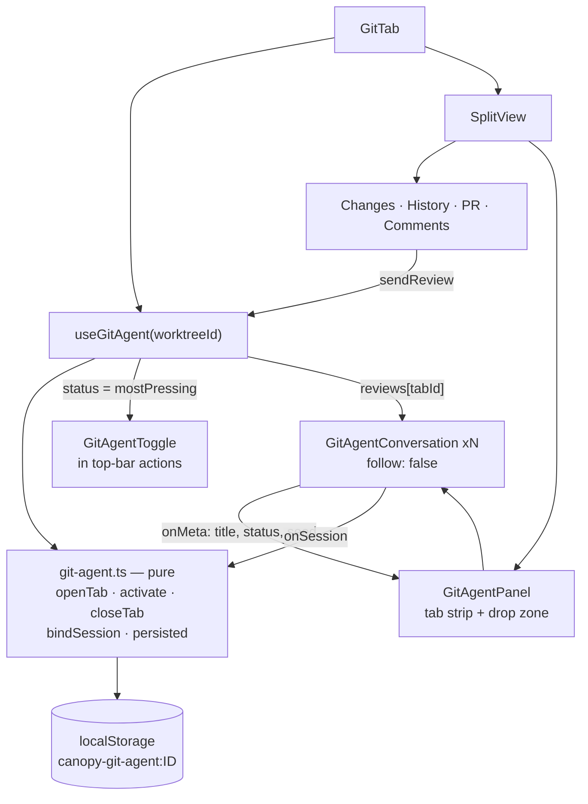
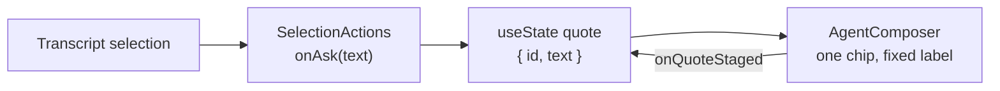
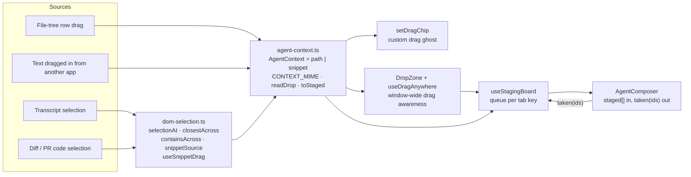
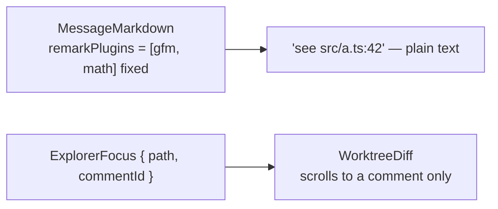
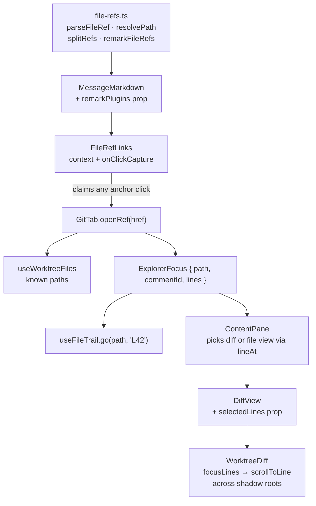
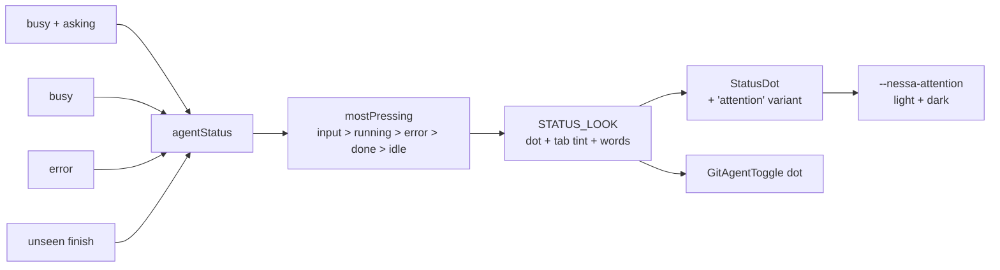
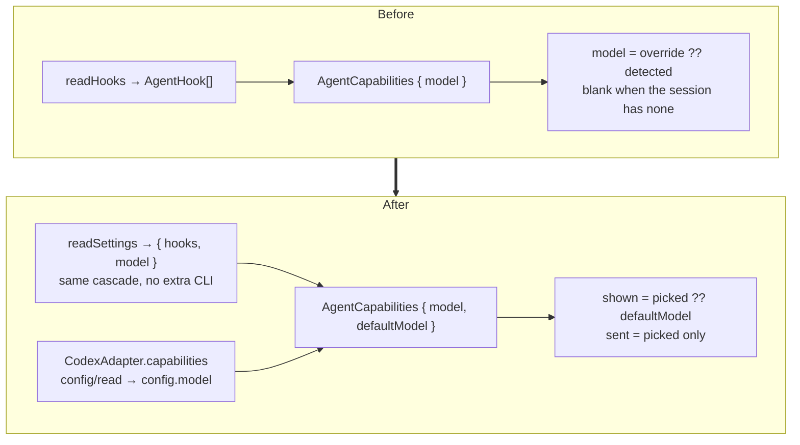

# Working-tree changes — block diagram

Uncommitted work on `research/ai-code-review`, as of 2026-10-08.
**23 files modified** (+390 / −179) · **16 new files** (~850 lines of source, 4 test files).

Five independent features. Each section is before → after.

---

## 0. The whole change, at a glance

| Feature | Blast radius |
| --- | --- |
| A. Git Agent dock | `git-tab`, `git-chrome`, dashboard screen, 7 new files |
| B. Context staging & drag-drop | composer, selection-actions, file-tree, 4 new files |
| C. File-reference navigation | markdown, diff-view, worktree-diff, content-pane, 2 new files |
| D. Agent status language | `status-dot`, `globals.css`, 1 new file |
| E. Default-model surfacing | daemon + shared schema + `use-worktree-agent` |

---

## A. Git Agent dock

Review comments used to leave the Git tab. Now the agent comes to the diff, as a tab strip docked to the right of every Git pane.

### Before

Costs: sending a review yanked you out of the diff, hijacked the worktree's pinned session, and allowed exactly one conversation at a time.

### After

Key decisions in the code:

- **Tabs are a pure reducer.** `git-agent.ts` holds no React — `closeTab` hands the panel to the next neighbour then the previous; `persisted` keeps only tabs whose session exists, so half-composed drafts die with the page.
- **Every tab stays mounted** (`hidden` when inactive), so a turn keeps streaming while you read another tab.
- **`follow: false`** is a new `useWorktreeAgent` mode: the conversation starts from *no* session and never reads or writes the worktree pin. That is what keeps the Agent tab independent.
- **Reviews are queued, not pushed.** `sendReview` routes to the tab already holding that session (else opens one); the tab fires it once `!busy` and the session matches, then calls `reviewSent`.
- `sending` on the CTA now reflects queued reviews, not the pinned agent's busy flag.

---

## B. Context staging & drag-and-drop

One quote slot became a typed context pipeline with four sources.

### Before

One slot, one source, one hard-coded label (`Quoted from the transcript (N lines)`). A second quote arriving before the composer took the first overwrote it.

### After

What this buys:

- **A queue, not a slot.** Two chips can arrive before the composer takes either (a new tab's own chip plus the snippet that opened it). The composer reports the exact ids it consumed.
- **Snippets know where they came from.** `data-file-path` on the content panes plus the renderer's `data-line` turn a highlight into a `src/a.ts:42–50` chip rather than loose text.
- **Shadow-DOM-aware selection.** The diff renderer draws into a shadow root, where `document.getSelection()` only sees the host. `selectionAt` / `closestAcross` / `containsAcross` climb across root boundaries — which is also what let `SelectionActions` be reused over diffs at all.
- **Drag grips are mode-sensitive.** In the commit panel the whole row sweeps a staging highlight, so only the file *icon* is draggable (`data-drag-handle`, which `useRowPointers` now skips); elsewhere the whole row drags.
- `SelectionActions` gained `askLabel` ("Ask Git Agent") and now hands back the `Range`, and releases the shadow root's own selection.

---

## C. File-reference navigation

An agent citing `routes/agents.ts:42` now gets you there.

### Before

### After

The careful bits:

- **Parsing is deliberately narrow.** The path pattern demands an extension starting with a letter, so `1.5:3`, version numbers and URLs never read as references. Both `:42-50` and `#L42-L50` are accepted — the two ways Claude Code and Codex cite.
- **`resolvePath` completes a unique tail.** Agents cite `routes/agents.ts`; the tab resolves it against the worktree's tracked paths to `packages/daemon/src/routes/agents.ts`, and leaves an ambiguous tail as written.
- **Links only exist where something can open them.** `useFileRefPlugins` returns `undefined` without a `FileRefLinks` host, so the Agent tab renders no dead links.
- **One click handler covers three link kinds** — markdown links, plugin-linked refs, and `click … href` inside a mermaid diagram — because all are anchors by paint time.
- **Scrolling is vertical-only and retried.** `scrollIntoView` would slide wide code sideways; the renderer paints after highlighting, so `scrollToLine` re-looks each frame for up to 60 frames and returns its own canceller.
- `ContentPane` auto-switches to the **file** view when the cited line isn't in any hunk.

---

## D. Agent status language

Before: `running | success | error | idle` on the dot, and no notion of "needs you" or "finished but unread". After: a finish stays visible as news until the tab is actually looked at, and the closed panel's toggle still shows the most pressing state across all tabs.

---

## E. Default-model surfacing

The nuance worth keeping: `defaultModel` is **shown, not sent**. The provider applies its own configured default anyway, so sending it would freeze today's setting into the turn and beat a later settings change.

---

## New files

| File | Lines | Role |
| --- | --- | --- |
| `lib/git-agent.ts` | 70 | Pure tab + status reducers |
| `lib/use-git-agent.ts` | 91 | Dock state, reviews, per-tab status |
| `lib/use-staging.ts` | 37 | Chip queues, one per composer |
| `lib/agent-context.ts` | 39 | Context type, MIME, drop reading |
| `lib/dom-selection.ts` | 79 | Shadow-DOM selection + snippet drag |
| `lib/file-refs.ts` | 91 | Reference parsing + remark plugin |
| `components/agent/file-ref-links.tsx` | 40 | Link claiming + plugin gating |
| `components/git/git-agent/panel.tsx` | 159 | Tab strip, drop handling |
| `components/git/git-agent/conversation.tsx` | 98 | One tab's conversation |
| `components/git/git-agent/status.tsx` | 41 | Status look + top-bar toggle |
| `components/git/git-agent/drop-zone.tsx` | 62 | Window-wide drag invitation |
| `components/git/git-agent/drag-chip.tsx` | 40 | Custom drag ghost |

Tests: `git-agent.test.ts`, `file-refs.test.ts`, `agent-context.test.ts`, `file-ref-links.test.tsx` — 18 cases, all against the pure modules.

## Gaps worth noting

- `useGitAgent` has no test; its routing logic (which tab a review lands on) is only covered indirectly.
- `dom-selection.ts` and the shadow-root `scrollToLine` retry loop are untested — both are the most environment-dependent code in the change.
- The `OPEN_KEY` for the dock is global, not per-worktree, unlike the tab state.
